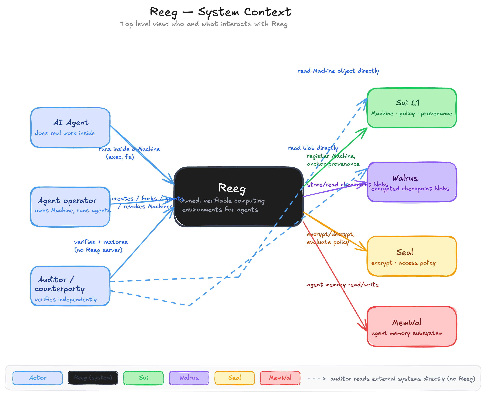

# Reeg

**Reeg is Dropbox for AI agent environments.**

Reeg is infrastructure for portable computing environments. We started with AI agents
because they're the fastest-growing source of ephemeral work, but the underlying system
can preserve and move any environment.

**Live on Sui mainnet** · [reeg.xyz](https://reeg.xyz) · [Read the docs →](docs/README.md)

---

## The problem

An AI agent runs for hours and does real work: writes code, moves money, changes
records. Then the session closes and the environment is **gone**. Not the chat log, the
actual working state. It was a row in a vendor's database, deleted on their schedule.

You couldn't keep it, hand the live workspace to a teammate, move it off the vendor, or
prove to anyone what really happened inside. You never owned the place the work happened.

That's the thing Reeg fixes.

## What you get

Reeg is the layer **over** whatever sandbox you already run, not the sandbox, not a
server, not an OS. At each commit it snapshots the whole working state, encrypts it on
your machine, and anchors a record to a Sui object only you control. Four things a folder
or a vendor dashboard can't give you:

- **Own**: every environment is a Sui `Machine` object you hold, plus your own data on
  Walrus. No vendor can change it, lock you out, or delete it.
- **Share**: hand over the *live* workspace (not a transcript) under an on-chain
  grant/revoke policy. Fork any good checkpoint to try two directions at once.
- **Move**: kill it on one host, restore it **byte-identically** on another, across
  machines *and* across runtime tiers (local, OCI, Firecracker).
- **Prove**: an append-only, hash-chained history anyone can verify **offline**, from
  public Sui + Walrus data alone. GitHub history can be rewritten; this can't.

## How it works

<p align="center">
  
</p>

You run the agent in whatever runner you like: Reeg's local engine, an OCI container, a
Firecracker microVM, or a third-party cloud. Reeg waits at the commit boundary:

**snapshot** → **Seal-encrypt** (on your machine) → **store on Walrus** (content-addressed
`blob_id`) → **anchor** the `blob_id` + `manifest_hash` to your `Machine` on Sui.

`restore` reverses it on any host. The capture is content-addressed (BLAKE3) and
deterministic (canonical umask, neutralized timestamps and ownership), which is what makes
a restore byte-identical across hosts and runtime tiers. **Nothing about verifying a past
run requires a live or honest Reeg service**: the Console is static, the indexer is
rebuildable, and `verify` reads only public Sui + Walrus.

→ Full walk-through, component by component:
[docs/02-architecture/system-architecture.md](docs/02-architecture/system-architecture.md).

## Try it

The whole operator loop runs from the `reeg` CLI. Point `REEG_ENGINE` at the built Rust
binary and run:

```sh
cargo build --manifest-path engine/Cargo.toml          # builds the reeg-engine binary
export REEG_ENGINE=engine/target/debug/reeg-engine
export REEG_NETWORK=testnet                             # or mainnet
export REEG_OPERATOR=<your address>                     # signs; must hold SUI + WAL

reeg create                                             # mint a Machine you own  -> <machineId>
reeg run      <machineId> -- sh -c 'echo hi > note.txt' # run a command, captured in the log
reeg checkpoint <machineId>                             # snapshot -> encrypt -> Walrus -> anchor on Sui
reeg restore  <machineId> --dest /tmp/restored          # Walrus -> decrypt -> byte-identical workdir
reeg grant    <machineId> <address> --role restore      # let another address decrypt and restore
reeg revoke   <machineId> <address>                     # stop future decryption (forward-looking)
reeg fork     <machineId>                               # child Machine, lineage recorded on chain
reeg verify   <machineId>                               # independent verify — public Sui + Walrus only
reeg evidence <machineId> --out evidence.json           # export a portable record for an auditor
reeg audit    evidence.json                             # verify that record offline (no Reeg, no chain)
```

Every `reeg` command is a thin wrapper over [@reeg/sdk](packages/sdk), so the same
operations are callable from TypeScript. The end-to-end acceptance demo creates and
checkpoints on host A, deletes host A, restores byte-identically on a fresh host B that
never saw it, verifies offline, shares to a grantee who restores on a third host, then
revokes:

```sh
REEG_ENGINE=engine/target/debug/reeg-engine pnpm --filter @reeg/test run live:acceptance
```

### Prove which code ran (optional, Nautilus)

On an AWS Nitro host, a reproducible enclave attests *which code* produced a checkpoint:

```sh
reeg enclave register                                        # verify the enclave's Nitro doc on chain
reeg checkpoint <machineId> --attest --enclave-config <id>   # enclave signs the checkpoint
```

`@reeg/verify` confirms it offline: the on-chain signature plus PCRs matching the
reproducible build. It's strictly additive: a checkpoint without `--attest` is
byte-identical.

## Proof it's real

- **Live on Sui mainnet**: package `0xfaa6b4af63a639c06e5d02c969c28111db5f01caea1067132c789fa7ebdb241e`
  (testnet `0x8f2faf0b89e248f498cb0bc4b0ef98511613c4d7884e8ce41f0bc255246ca1d2`).
- **Measured cost**: ~0.0099 SUI + ~0.0119 WAL per create + encrypted checkpoint (1 epoch,
  incl. the Walrus upload-relay tip).
- **Green in CI**: Move 40/40 (incl. attestation with a real ed25519 vector), `@reeg/verify`
  54/54, `@reeg/chain` 21/21, `@reeg/crypto` 8/8 (cross-language vs the Move vector).
- **Verified on a real AWS KVM host** (c8i.2xlarge): Firecracker 8/8 + jailer, OCI 3/3,
  lib 11/11; Phase M hardening 19/19. Reproducible enclave: identical PCRs across
  cache-cleared rebuilds.

> **Honest note.** Mainnet has no free public Seal key server yet, so the **decrypt**
> (restore) of a Seal-encrypted checkpoint currently waits on a provider key server.
> Encryption, storage, anchoring, and **offline verification all work on mainnet today**;
> the full encrypted checkpoint → restore → verify loop is proven end-to-end on **testnet**.

## Repo layout

A pnpm + Turborepo monorepo. The Rust engine and the TypeScript client meet at exactly one
artifact boundary (a manifest plus content-addressed files) so the same captured
environment crosses hosts and runtime tiers byte-identically.

| Path | What | Language |
| --- | --- | --- |
| [move/](move/) | on-chain `Machine`, provenance, `seal_approve` policies, attestation verifier | Move 2024 |
| [engine/](engine/) | snapshot/restore engine + runtime tiers (Local, OCI, Firecracker + jailer) | Rust |
| [enclave/](enclave/) | reproducible AWS Nitro attestation enclave (`.eif` + pinned PCRs) | Rust |
| [packages/chain/](packages/chain/) | Sui client: read `Machine`, build PTBs | TypeScript |
| [packages/storage/](packages/storage/) | Walrus adapter: store/read blobs | TypeScript |
| [packages/crypto/](packages/crypto/) | Seal adapter + Nautilus preimage/verify | TypeScript |
| [packages/verify/](packages/verify/) | the independent offline verifier (provenance + attestation) | TypeScript |
| [packages/sdk/](packages/sdk/) | public SDK tying the adapters together | TypeScript |
| [packages/cli/](packages/cli/) | the `reeg` CLI | TypeScript |
| [packages/mcp/](packages/mcp/) | MCP server: drive Reeg from an agent | TypeScript |
| [apps/console/](apps/console/) | the Console, deployed as a static Walrus Site | TypeScript / React |
| [apps/web/](apps/web/) | the marketing site ([reeg.xyz](https://reeg.xyz)) | TypeScript / Next.js |
| [apps/api/](apps/api/) | Enoki-sponsored paymaster: gas-free zkLogin actions | TypeScript |
| [apps/indexer/](apps/indexer/) | display-only indexer, rebuildable from chain events | TypeScript |
| [config/](config/) | per-network config (testnet, mainnet) | JSON |

### Toolchain

Node ≥ 24 · pnpm 10 · Turborepo · Biome · Rust 1.95 · Sui CLI 1.73 · Walrus CLI · Move
2024. Platform SDKs at current releases: `@mysten/sui` ^2.17, `@mysten/walrus` ^1.1,
`@mysten/seal` ^1.1.

```sh
cp .env.example .env        # then fill in; never commit .env
pnpm install                # install the TypeScript workspaces
pnpm build && pnpm test     # build + unit tests
cargo build --manifest-path engine/Cargo.toml   # the Rust engine
sui move build --path move                       # the Move package
```

## Docs

Everything (product, architecture, business, and the whitepaper) lives in
**[docs/](docs/README.md)**. Good places to start:

- [Product vision](docs/00-overview/product-vision.md): what Reeg is, who it's for, why it exists.
- [System architecture](docs/02-architecture/system-architecture.md): how it's built, with diagrams.
- [Positioning](docs/00-overview/positioning.md): the canonical one-liner and the four pillars.
- [Whitepaper](docs/whitepaper/reeg-whitepaper.md): the full technical and product case.
- [Build roadmap](docs/03-engineering/build-roadmap.md): the build sequence and what's done.

---

*Reeg is the layer over the sandbox you already use. You run the agent; Reeg versions and
proves what it did; and the environment is yours, on no one's server.*
